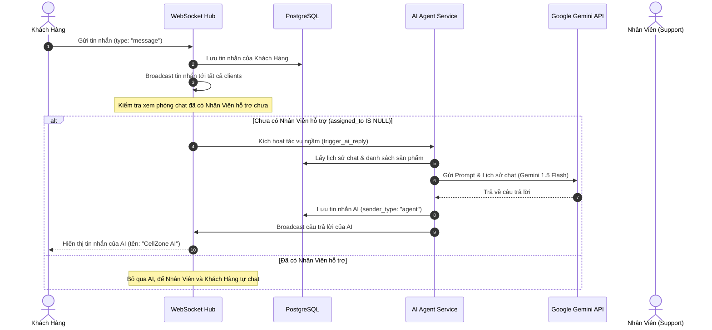

# Hướng Dẫn Tích Hợp AI Agent Vào Live Chat CellZone

Tôi đã thiết kế và tích hợp thành công một **AI Agent** tự động trả lời khách hàng vào hệ thống Live Chat tự xây dựng của bạn. Giải pháp này hoạt động hoàn toàn ở phía Backend (FastAPI) dưới dạng tác vụ chạy ngầm (Background Task) mà **không yêu cầu bạn phải thay đổi bất kỳ dòng mã nào ở Frontend (React)**.

---

## 1. Kiến Trúc Hoạt Động (Architecture)

Quy trình hoạt động của AI Agent tích hợp trong luồng WebSocket hiện tại:



---

## 2. Các Thay Đổi & File Mới

### A. File Mới: `backend/app/services/ai_agent.py`
Tạo dịch vụ AI Agent chuyên xử lý:
- Tải thông tin các sản phẩm đang có tại cửa hàng (từ bảng `products` của PostgreSQL) để làm ngữ cảnh hỗ trợ khách hàng.
- Gom và định dạng lịch sử trò chuyện đúng định dạng của Gemini (đảm bảo xen kẽ giữa `user` và `model` để tránh lỗi API).
- Gọi API của **Gemini 1.5 Flash** qua thư viện `httpx` (đã có sẵn trong dự án) giúp tối ưu tốc độ và không cần cài thêm thư viện ngoài.
- Tự động lưu phản hồi của AI vào DB dưới vai trò `agent` và phát lên kênh WebSocket của bạn.

> [!NOTE]
> File dịch vụ đã được tạo tại: [ai_agent.py](file:///C:/Users/nchit/Projects/phone-store/DU-AN-POLY/backend/app/services/ai_agent.py)

### B. Cập Nhật Cấu Hình: `backend/app/config.py`
Thêm biến cấu hình `gemini_api_key` vào lớp `Settings` để tự động đọc key từ file `.env` hoặc biến môi trường.

> [!NOTE]
> File cấu hình đã cập nhật tại: [config.py](file:///C:/Users/nchit/Projects/phone-store/DU-AN-POLY/backend/app/config.py)

### C. Cập Nhật WebSocket: `backend/app/main.py`
Lắng nghe sự kiện khách hàng gửi tin nhắn lên WebSocket, nếu chưa có nhân viên được gán (`assigned_to is None`), hệ thống sẽ gọi tác vụ AI trả lời chạy ngầm.

> [!NOTE]
> File chạy chính đã cập nhật tại: [main.py](file:///C:/Users/nchit/Projects/phone-store/DU-AN-POLY/backend/app/main.py)

---

## 3. Hướng Dẫn Cấu Hình API Key

Để AI Agent hoạt động thực tế với mô hình trí tuệ nhân tạo, bạn cần cấu hình Gemini API Key:

1. **Lấy API Key miễn phí:**
   Truy cập [Google AI Studio](https://aistudio.google.com/) và tạo một API Key (Miễn phí hoàn toàn cho mục đích thử nghiệm và phát triển).

2. **Cấu hình vào dự án của bạn:**
   Mở hoặc tạo file `.env` trong thư mục backend của bạn:
   [backend/.env](file:///C:/Users/nchit/Projects/phone-store/DU-AN-POLY/backend/.env)
   
   Thêm dòng sau vào cuối file:
   ```env
   GEMINI_API_KEY=AIzaSy... (Điền API Key của bạn vào đây)
   ```

3. **Chế độ chạy thử nghiệm (Local Fallback):**
   Nếu bạn chưa điền `GEMINI_API_KEY`, hệ thống sẽ **không bị crash**. AI Agent đã được lập trình sẵn cơ chế fallback để trả về một câu trả lời mẫu thông báo hệ thống đang bảo trì, giúp bạn chạy thử nghiệm luồng WebSocket cục bộ bình thường.

---

## 4. Tùy Chỉnh Tính Cách & Dữ Liệu Của AI

Bạn có thể chỉnh sửa cách AI xưng hô hoặc hướng dẫn nó trả lời bằng cách chỉnh sửa biến `system_instruction` trong file `backend/app/services/ai_agent.py`:

```python
system_instruction = (
    "Bạn là AI Trợ Lý chăm sóc khách hàng trực tuyến của cửa hàng điện thoại CellZone...\n"
    # Sửa đổi hướng dẫn, chính sách bảo hành, giờ làm việc... tại đây
)
```
Mô hình `gemini-1.5-flash` hỗ trợ tiếng Việt cực kỳ tốt, tự động nhận diện giá cả sản phẩm từ cơ sở dữ liệu để báo giá chính xác cho khách hàng.
